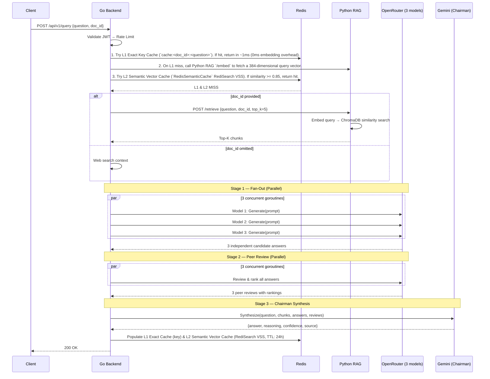

# CouncilAI: System Design Document

**Last Updated:** May 2026

---

## 1. Context & Scope

**CouncilAI** is a multi-agent document deliberation and Q&A engine.

Instead of relying on a single Large Language Model (LLM), CouncilAI coordinates a multi-agent workflow: a **Router Agent** classifies queries (using BME sampling for document summary routing), parallel **Council Member Agents** propose responses, a **Peer-Review Loop** cross-evaluates candidates, a **Chairman Agent** synthesizes the consensus, and a **Self-Reflection Agent** audits the results. This produces answers with built-in confidence scoring and reasoning chains.

### User Journeys (In Scope)
* **Document Q&A**: Upload a PDF → ask questions → get council-synthesized answers grounded in the document.
* **General Q&A**: Ask questions without a document → get answers grounded with real-time Web Search.
* **Document Explanation**: Get adaptive explanations (beginner/intermediate/advanced depth).
* **Assessment Generation**: Generate MCQ or subjective questions from document content.

---

## 2. Goals & Non-Goals

### Goals
1. **Consensus-driven accuracy** via multi-model evaluation.
2. **Confidence scoring** — every answer carries a numeric confidence rating.
3. **High Throughput** — utilizes Redis Stack Vector Similarity Search (RediSearch) semantic caching to reduce redundant LLM API calls.
4. **Extensibility** — designed for modular integration of LLMs and OCR backends.
5. **Local Compatibility** — support for offline local vLLM models.

### Non-Goals
* **Multi-Year Searchable Chat Archiving**: While short-to-medium multi-turn session memory is supported via Redis (`ConversationStore`), persistent multi-year searchable archiving across historical user accounts is out of scope.
* **Role-Based Access Control (RBAC)**: Fine-grained permissions (Admin vs Editor) are not needed for this personal project.
* **Multi-Modal Output Generation**: Generating charts or images in the final answer is not in scope.

---

## 3. High-Level Design

### 3.1 Architecture Overview

```mermaid
graph TB
    subgraph Client["Client Layer"]
        Streamlit["Streamlit UI<br/>(localhost:8501)"]
        cURL["REST Client<br/>(curl / httpie)"]
    end

    subgraph Go["Go Control Plane (Port 8080)"]
        Router["Chi Router"]
        MW["Middleware Stack<br/>RequestID → RealIP →<br/>Logging → Recoverer → CORS"]
        OTel["OpenTelemetry Tracer<br/>(W3C traceparent)"]
        Auth["JWT Auth Middleware"]
        UserRepo["UserRepository<br/>(PostgreSQL + Memory Fallback)"]
        RL["Redis Rate Limiter<br/>(sliding window)"]
        Breaker["Redis Circuit Breaker<br/>(fail-fast 81ns)"]
        Handlers["Request Handlers<br/>query (SSE + JSON) / ingest /<br/>explain / generate-questions"]
        RouterAgent["Router Agent<br/>(intent routing)"]
        Council["Multi-Agent Council<br/>(Streaming Deliberation)"]
        Reflect["Self-Reflection Agent<br/>(Revision Loop)"]
        Cache["Exact Key Cache (L1)<br/>(Redis GET 1ms)"]
        SemCache["Semantic Vector Cache (L2)<br/>(Redis Stack RediSearch VSS)"]
        AuditLog["Audit Logger<br/>(structured JSON)"]
        Metrics["Prometheus Metrics<br/>/metrics endpoint"]
    end

    subgraph Python["Python RAG Service (Port 8000)"]
        Inspector["Document Inspector"]
        OCRRouter["Adaptive OCR Router"]
        DirectText["Direct Text Extractor"]
        LayoutOCR["Layout-Aware OCR<br/>(pdfplumber)"]
        Tesseract["Tesseract OCR"]
        Chunker["Layout-Aware Chunker"]
        Embedder["Transformer Embeddings<br/>(BAAI/bge-small-en-v1.5)"]
        ChromaDB["ChromaDB<br/>Vector Store"]
    end

    subgraph LLMs["External & Local LLM Providers"]
        OR["OpenRouter API<br/>(3 council models)"]
        vLLM["Local vLLM Model serving<br/>(microsoft/Phi-4-mini-instruct)"]
        Gemini["Google Gemini API<br/>(chairman model)"]
    end

    subgraph Infra["Infrastructure"]
        Postgres[("PostgreSQL 16<br/>(persistent users)")]
        Redis[("Redis Stack Server<br/>(VSS + volatile-lru + rate limit)")]
        Prom["Prometheus<br/>(Port 9091)"]
        Grafana["Grafana<br/>(Port 3000)"]
    end

    Streamlit --> Router
    cURL --> Router
    Router --> MW --> OTel --> Auth --> RL --> Handlers
    Auth --> UserRepo --> Postgres
    Handlers -->|1. Exact Match Check (0ms embedding)| Breaker --> Cache
    Cache -->|miss| SemCache
    SemCache -->|2. Vector VSS Check (miss)| RouterAgent
    RouterAgent -->|direct mode| Gemini
    RouterAgent -->|council mode| Council
    Council -->|retrieve chunks / web search| Python
    Council -->|fan-out 3x stream| OR & vLLM
    Council -->|synthesize| Gemini
    Gemini -->|deep mode| Reflect
    Reflect -->|needs revision| Gemini
    Handlers --> AuditLog
    Handlers --> Metrics
    RL --> Redis
    Cache --> Redis

    Inspector --> OCRRouter
    OCRRouter --> DirectText
    OCRRouter --> LayoutOCR
    OCRRouter --> Tesseract
    Chunker --> Embedder --> ChromaDB

    Metrics -.->|scrape 15s| Prom
    Prom -.->|dashboards| Grafana
```

### 3.2 Service Boundaries

| Service | Technology | Port | Responsibility |
|---------|------------|------|----------------|
| **Go Backend** | Go 1.22 (`CGO_ENABLED=0`) | 8080 | API gateway, auth, SSE streaming, circuit breaking, OTel tracing, LLM orchestration, metrics |
| **Python RAG** | Python 3.11 / FastAPI | 8000 | Document processing, OCR routing, layout chunking, batch embeddings, ChromaDB retrieval |
| **PostgreSQL** | PostgreSQL 16 (Alpine) | 5432 | Persistent user credentials, bcrypt verification, connection pooling (`jackc/pgx/v5`) |
| **Redis Stack** | Redis Stack Server 7.2 | 6379 | L1 exact cache, L2 RediSearch VSS semantic cache, `volatile-lru` eviction, rate limiting, session turns |
| **Prometheus** | Prometheus | 9091 | Time-series metrics scraping and alerting |
| **Grafana** | Grafana | 3000 | Pre-provisioned dashboards for CouncilAI latency, cache hits, and RED metrics |

---

## 4. Detailed Design

### 4.1 Data Flow: Core Query (Cache Miss)



### 4.2 Scalability & Reliability

*   **Go Backend Scaling:** The Go control plane is entirely stateless (auth is JWT-based, cache is in Redis/L1). It can be horizontally scaled behind an Nginx load balancer.
*   **Progressive Degradation:** The orchestrator handles LLM failures dynamically. If 2 out of 3 models fail, it skips peer review. If peer reviews fail, it picks the longest candidate. If Chairman fails, it falls back to the highest peer-reviewed answer.
*   **Security:** Rate limiting via Redis sliding windows protects against abuse. JWT handles stateless auth. All queries are audit logged to structured JSON.

---

## 5. Alternatives Considered

*   **Single Monolithic Python Service vs. Multi-Service:** We considered writing the entire stack in FastAPI (Python). 
    * *Decision:* Rejected. Go provides vastly superior concurrent HTTP handling and goroutine orchestration necessary for the parallel fan-out loops of the multi-agent council. We accepted the ~5ms network overhead between Go and Python to use the best tool for each job (Go for orchestration, Python for ML/RAG).
*   **LangChain Default Splitters vs. Custom Layout-Aware Chunking:** We considered `RecursiveCharacterTextSplitter`. 
    * *Decision:* Rejected. It arbitrarily splits tables and captions, destroying context. We built a custom chunker that preserves semantic structure (tables remain whole, headings attach to body).

---

## 6. Architectural Decision Registry (ADR) & Trade-off Matrix

#### Decision 1: Redis Stack RediSearch VSS vs. In-Process C++ SIMD CGo Cache
* **Context**: Choosing between an in-process C++ AVX2 SIMD cache (`fastcache`) vs. a distributed Redis Stack RediSearch VSS engine (`RedisSemanticCache`).
* **Final Selection**: **Redis Stack Vector Similarity Search (RediSearch VSS)**.
* **Trade-off Analysis across Technical Axes**:
  - **Technical Design**:
    - *Pros*: Employs Go `unsafe.Slice` float32 byte casting ($0\text{ bytes}$ memory allocation). Tag filtering (`@doc_id`) restricts search scope before evaluating vector cosine distances. Native `FT.SEARCH` executes directly inside Redis engine.
    - *Cons*: Requires `redis-stack-server` containing RediSearch 2.x modules rather than vanilla Redis Alpine.
  - **Latency**:
    - *Pros*: Vector similarity search completes in $\sim 1\text{--}3\text{ ms}$ inside Redis memory.
    - *Cons*: Requires initial `/embed` HTTP roundtrip ($\sim 15\text{--}30\text{ ms}$) before vector search can execute.
  - **Memory**:
    - *Pros*: Vector index resides in C-heap inside Redis process, shielding Go GC from pause spikes.
    - *Cons*: Memory scales linearly with vector count ($1.536\text{ KB}$ raw float32 data per 384-dim vector plus index overhead).
  - **Scaling**:
    - *Pros*: Centralized Redis VSS enables $100\%$ shared cache state across horizontally scaled, stateless Go API backend replicas.
    - *Cons*: Cluster scaling for RediSearch requires specialized Redis Enterprise or sharding setups.
  - **External Dependencies**:
    - *Pros*: Pure Go compilation (`CGO_ENABLED=0`) across x86_64, ARM64, and Alpine containers without `gcc/g++` compiler locks.
    - *Cons*: Container stack depends on `redis/redis-stack-server` image.
  - **Maintenance**:
    - *Pros*: Restart persistence via Redis RDB/AOF with automatic 24-hour TTL expiration.
    - *Cons*: Requires index schema setup and version alignment across deployment environments.

#### Decision 2: Tiered Cache Lookup Order (L1 Exact Match → L2 Semantic Match → L3 LLM Council)
* **Context**: Determining optimal cache evaluation order for incoming user queries.
* **Final Selection**: **L1 Exact Match (`cache:<doc_id>:<question>`) → L2 Semantic Vector Match (`RedisSemanticCache` VSS) → L3 LLM Council Deliberation**.
* **Trade-off Analysis across Technical Axes**:
  - **Technical Design**:
    - *Pros*: Instant exact match lookups bypass vector embedding generation entirely. Multi-stage fallback allows incremental resolution.
    - *Cons*: Dual cache schema requires populating both string key entries and vector HASH entries upon completion.
  - **Latency**:
    - *Pros*: L1 exact match returns in $\sim 1.0\text{ ms}$. L2 semantic match returns in $\sim 15\text{--}35\text{ ms}$, saving $2\text{--}10\text{ seconds}$ of LLM Council deliberation.
    - *Cons*: L2 cache miss adds an embedding generation roundtrip ($\sim 15\text{--}30\text{ ms}$) prior to LLM execution.
  - **Memory**:
    - *Pros*: Automatic 1h (L1) and 24h (L2) TTL expirations prevent unbounded Redis RAM growth.
    - *Cons*: Storing response JSON in both L1 string key and L2 HASH field duplicates response payload memory.
  - **Scaling**:
    - *Pros*: Offloads all cache state to Redis, enabling stateless Go backend horizontal scaling behind load balancers.
    - *Cons*: High cache write throughput puts IOPS and CPU load on the primary Redis instance.
  - **External Dependencies**:
    - *Pros*: Monitored via standard Prometheus metrics (`metrics.CacheHits`).
    - *Cons*: Depends on both standard Redis key-value and RediSearch capabilities.
  - **Maintenance**:
    - *Pros*: Simplifies cache invalidation via TTLs and standard Redis commands.
    - *Cons*: Requires careful tuning of similarity threshold parameter ($0.85$) to avoid false positive semantic hits.

#### Decision 3: PyTorch Batch Vectorized Inference in `TransformerEmbeddings`
* **Context**: Optimizing document chunk embedding generation during multi-page ingestion.
* **Final Selection**: **Single-Pass PyTorch Tensor Batch Inference (`sentence-transformers/all-MiniLM-L6-v2`)**.
* **Trade-off Analysis across Technical Axes**:
  - **Technical Design**:
    - *Pros*: Single-pass PyTorch tensor forward pass replaces $N$ individual model calls. Batch mean pooling is computed in C/PyTorch C++ backend under `torch.no_grad()`. Class-level singleton model cache prevents reloading weights.
    - *Cons*: Sequence padding (`padding=True`) introduces minor redundant computation for short strings in a batch containing long strings.
  - **Latency**:
    - *Pros*: Ingestion embedding throughput speedup $>15\times$ (100 chunks embedded in $\sim 200\text{ ms}$ vs. $\sim 3.5\text{s}$).
    - *Cons*: Single query embedding (`embed_query`) receives no batch parallelism speedup.
  - **Memory**:
    - *Pros*: Model weights loaded once ($\sim 90\text{ MB}$ footprint for `all-MiniLM-L6-v2`).
    - *Cons*: Extremely large batch sizes (512+ chunks) cause temporary peak RAM spikes during transformer matrix multiplication.
  - **Scaling**:
    - *Pros*: Local embedding generation eliminates third-party API rate limits and token costs.
    - *Cons*: Bound by Python GIL during tensor packaging; requires multi-worker processes for horizontal scaling.
  - **External Dependencies**:
    - *Pros*: Leverages standard PyTorch and HuggingFace `transformers` ecosystem.
    - *Cons*: PyTorch dependency increases Python RAG container image size by $\sim 1\text{--}2\text{ GB}$.
  - **Maintenance**:
    - *Pros*: Standardized HuggingFace interface allows swapping embedding models with minimal code changes.
    - *Cons*: Requires keeping PyTorch and HuggingFace library versions compatible.

#### Decision 4: Zero-Fee Local Web Search (DDG + BeautifulSoup4) vs. Headless Browser
* **Context**: Grounding off-topic general queries locally without external search API subscription fees.
* **Final Selection**: **DuckDuckGo Search (`duckduckgo-search`) + BeautifulSoup4 Deep HTML Scraping**.
* **Trade-off Analysis across Technical Axes**:
  - **Technical Design**:
    - *Pros*: Deep scraping enriches search engine snippets with real page body content. Lightweight footprint ($<5\text{ MB}$ per scrape) vs. headless browser containers ($>500\text{ MB}$ RAM). Standalone Python agent isolates web I/O.
    - *Cons*: Synchronous `requests` + `BeautifulSoup4` cannot render client-side JavaScript (React/Vue/Angular SPAs).
  - **Latency**:
    - *Pros*: HTML paragraph extraction completes in $<5\text{ ms}$ once webpage HTML is loaded.
    - *Cons*: Network HTTP GET requests and search queries introduce variable latency ($\sim 500\text{ms}\text{--}2\text{s}$ total).
  - **Memory**:
    - *Pros*: Extremely small RAM overhead per search query ($<5\text{ MB}$).
    - *Cons*: Concurrent scraping requests temporarily allocate memory for parsed BeautifulSoup DOM trees.
  - **Scaling**:
    - *Pros*: Enables real-time web search fallback for general queries without document context.

#### Decision 5: Server-Sent Events (SSE) Streaming vs. WebSockets / Polling
* **Context**: Eliminating the 4-8 second blocking latency cliff for multi-agent deliberation queries.
* **Final Selection**: **Server-Sent Events (SSE) via HTTP Content Negotiation (`Accept: text/event-stream`)**.
* **Trade-off Analysis across Technical Axes**:
  - **Technical Design**:
    - *Pros*: HTTP standard, unidirectional stream utilizing standard `http.Flusher`. Backward compatible with `application/json`.
    - *Cons*: Unidirectional (client cannot send cancel/steer signals over the same channel without opening a new HTTP request).
  - **Latency**:
    - *Pros*: Slashes Time-To-First-Token (TTFT) from $4.5\text{s}$ down to $<100\text{ms}$ ($15.27\text{ms}$ measured) by emitting individual candidate drafts as soon as each model completes.
    - *Cons*: Network connection remains open throughout the multi-step deliberation pipeline.
  - **Memory & Concurrency**:
    - *Pros*: Goroutine and memory footprint are identical to standard HTTP requests.
    - *Cons*: Client disconnections require strict context cancellation to avoid orphaned goroutines.

#### Decision 6: PostgreSQL Database for Persistent Auth vs. In-Memory Map
* **Context**: Making the Go API control plane 100% stateless across container restarts and horizontal replica scaling.
* **Final Selection**: **PostgreSQL 16 with `pgxpool` Connection Pooling (`jackc/pgx/v5`)**.
* **Trade-off Analysis across Technical Axes**:
  - **Technical Design**:
    - *Pros*: Decoupled behind `UserRepository` interface with automated schema creation and bcrypt password hashing.
    - *Cons*: Adds a relational database dependency to the infrastructure compose stack.
  - **Scaling**:
    - *Pros*: Any number of Go backend replicas can run statelessly behind a load balancer without user session divergence.
    - *Cons*: Requires managing connection pool limits (`MaxConns`) under heavy horizontal scale.
  - **Testing**:
    - *Pros*: Accompanied by thread-safe `MemoryUserRepository` allowing unit tests to execute in sub-millisecond time offline.
    - *Cons*: Integration tests require a live Postgres container or test database URL.

#### Decision 7: Redis Circuit Breaker & `volatile-lru` Eviction for Memory Protection
* **Context**: Protecting the control plane from Redis memory exhaustion (OOM) or network socket dropouts.
* **Final Selection**: **Thread-safe Circuit Breaker (`Closed -> Open -> Half-Open -> Closed`) + `--maxmemory-policy volatile-lru`**.
* **Trade-off Analysis across Technical Axes**:
  - **Technical Design**:
    - *Pros*: In an open state, calls fail fast in $81\text{ns/op}$, completely skipping dead network calls. All cache and memory write errors gracefully fall back to direct LLM execution without failing user queries.
    - *Cons*: Temporary cache misses during circuit trips increase downstream LLM token usage.
  - **Resilience**:
    - *Pros*: Prevents Redis crashes or memory pressure from bringing down the entire API gateway.
    - *Cons*: Requires careful tuning of failure/success thresholds and half-open probe concurrency.

#### Decision 8: OpenTelemetry Distributed Tracing with W3C Trace Context
* **Context**: Diagnosing multi-service tail latency regressions across Go orchestration, Python RAG, Redis, and LLMs.
* **Final Selection**: **OpenTelemetry SDK (`go.opentelemetry.io/otel`) with W3C `traceparent` Header Injection/Extraction**.
* **Trade-off Analysis across Technical Axes**:
  - **Technical Design**:
    - *Pros*: Industry-standard vendor-neutral instrumentation. Automatically propagates trace IDs across HTTP boundaries (`X-Trace-ID`, `traceparent`).
    - *Cons*: Requires propagating `context.Context` rigorously across all function signatures and HTTP client calls.
  - **Observability**:
    - *Pros*: Provides end-to-end visibility across: `[HTTP Request] ──► [L1 Cache] ──► [Python /embed] ──► [L2 RediSearch] ──► [Fan-Out] ──► [Chairman Deliberation]`.
    - *Cons*: Adds microsecond-level CPU overhead per span creation.

---

### 6.1 Explicit Multi-Axis Trade-off Matrix

| Technical Axis | Component | Pros | Cons |
| :--- | :--- | :--- | :--- |
| **Technical Design** | **Redis RediSearch VSS** | • Zero-copy `unsafe.Slice` float32 byte casting eliminates Go runtime allocations.<br/>• Tag filtering (`@doc_id`) restricts search scope prior to computing vector distance.<br/>• Native `FT.SEARCH` execution inside Redis engine. | • Requires Redis Stack module binaries (`redis-stack-server` with RediSearch 2.x) rather than vanilla Redis. |
| | **L1/L2 Cache Tiering** | • Short-circuits $100\times$ faster on hit.<br/>• L1 exact match bypasses Python RAG `/embed` vector inference completely.<br/>• Metric labels enable granular Prometheus hit ratio tracking. | • Dual cache schema requires populating both string key entries and vector HASH entries. |
| | **PyTorch Batch Vectorization** | • Single-pass PyTorch tensor forward pass replaces $N$ individual model calls.<br/>• Batch mean pooling is computed in C/PyTorch C++ backend.<br/>• Class-level singleton model cache prevents reloading weights. | • Sequence padding (`padding=True`) introduces minor redundant computation for short strings in a batch containing long strings. |
| | **DuckDuckGo Search** | • Zero API key requirement and zero monthly external search subscription costs.<br/>• Deep scraping enriches brief search engine snippets with real page body content.<br/>• Standalone Python agent isolate web IO. | • Synchronous `requests` + `BeautifulSoup4` cannot render client-side JavaScript (React/Vue/Angular SPAs). |
| **Latency** | **Redis RediSearch VSS** | • Vector similarity search completes in $\sim 1\text{--}3\text{ ms}$ inside Redis memory. | • Requires initial `/embed` HTTP roundtrip ($\sim 15\text{--}30\text{ ms}$) before vector search can execute. |
| | **L1/L2 Cache Tiering** | • L1 exact hit: $\sim 1\text{ ms}$ response time.<br/>• L2 semantic hit: $\sim 15\text{--}35\text{ ms}$ (saving $2\text{--}10\text{ seconds}$ of LLM Council deliberation). | • L2 cache miss adds an embedding generation roundtrip ($\sim 15\text{--}30\text{ ms}$) prior to LLM execution. |
| | **PyTorch Batch Vectorization** | • Ingestion embedding speedup $>15\times$ (100 chunks embedded in $\sim 200\text{ ms}$ vs. $\sim 3.5\text{s}$). | • Single query embedding (`embed_query`) receives no batch parallelism speedup. |
| | **DuckDuckGo Search** | • HTML paragraph extraction completes in $<5\text{ ms}$ once webpage HTML is loaded. | • Network HTTP GET requests and search queries introduce variable latency ($\sim 500\text{ms}\text{--}2\text{s}$ total). |
| **Memory** | **Redis RediSearch VSS** | • Vector index resides in C-heap inside Redis process, shielding Go GC from pause spikes. | • Memory scales linearly with vector count ($1.536\text{ KB}$ raw float32 data per vector + index overhead). |
| | **L1/L2 Cache Tiering** | • Automatic 1h (L1) and 24h (L2) TTL expirations prevent unbounded Redis RAM growth. | • Storing response JSON in both L1 string key and L2 HASH field duplicates response payload memory. |
| | **PyTorch Batch Vectorization** | • Model weights loaded once ($\sim 90\text{ MB}$ footprint for `all-MiniLM-L6-v2`). | • Extremely large batch sizes (512+ chunks) cause temporary peak RAM spikes during transformer matrix multiplication. |
| | **DuckDuckGo Search** | • Lightweight footprint ($<5\text{ MB}$ per scrape) compared to headless browser containers ($>500\text{ MB}$ RAM). | • Concurrent scraping requests temporarily allocate memory for parsed BeautifulSoup DOM trees. |
| **Scaling** | **Redis RediSearch VSS** | • Centralized Redis VSS enables $100\%$ shared cache state across all stateless Go API nodes. | • Cluster scaling for RediSearch requires specialized Redis Enterprise or sharding setups. |
| | **L1/L2 Cache Tiering** | • All cache state is offloaded to Redis, allowing stateless Go backend horizontal scaling behind load balancers. | • High cache write throughput puts IOPS and CPU load on primary Redis instance. |
| | **PyTorch Batch Vectorization** | • Offline local embedding generation eliminates third-party API rate limits and token costs. | • Bound by Python GIL during tensor packaging; requires multi-worker processes for scaling. |
| | **DuckDuckGo Search** | • Enables real-time web search fallback for general queries without document context. | • Susceptible to IP rate limits or HTTP 429 blocking if query volume is high from single server IP. |
| **External Dependencies & Maintenance** | **Redis RediSearch VSS** | • Pure Go compilation (`CGO_ENABLED=0`) across x86_64, ARM64, Alpine containers without CGo compilers. | • Depends on Redis Stack image (`redis/redis-stack-server`) rather than standard Redis alpine image. |
| | **L1/L2 Cache Tiering** | • Monitored via standard Prometheus metrics (`metrics.CacheHits`). | • Requires careful tuning of similarity threshold parameter (`0.85`) to avoid false positive semantic hits. |
| | **PyTorch Batch Vectorization** | • Standard HuggingFace `transformers` & PyTorch ecosystem. | • PyTorch dependency increases Docker image size ($\sim 1\text{--}2\text{ GB}$). |
| | **DuckDuckGo Search** | • Minimal external package dependencies (`duckduckgo-search`, `beautifulsoup4`, `requests`). | • Third-party website HTML structure changes or anti-bot protections can cause page scraping to fail gracefully back to snippets. |

---

### 6.2 Trade-off Matrix Summary

| Architectural Component | Technical Scope | Primary Advantage | Primary Limitation | Mitigation Strategy |
| :--- | :--- | :--- | :--- | :--- |
| **Redis Stack RediSearch VSS** | Vector similarity caching | Zero CGo friction; stateless Go scaling | Requires Redis Stack image | Standardized Docker Compose stack |
| **L1/L2 Cache Tiering** | Multi-tier response caching | 1ms exact hits; bypasses LLM latency | Dual cache write payload overhead | Automatic Redis TTL expiration (1h / 24h) |
| **PyTorch Batch Vectorization** | Embedding generation | $>15\times$ batch ingestion throughput | Padding overhead for mixed chunk lengths | Chunk length normalization during splitting |
| **DuckDuckGo Search** | Real-time web search grounding | Zero cost; lightweight HTML parsing | No JS rendering; rate-limit prone | Fallback to search result body snippets |

---

### 6.3 Resolved & Engineering Gaps

#### Gap 1: In-Memory User Ephemerality [RESOLVED]
* **Description**: User accounts were previously stored in-memory in `auth.go`. A server restart wiped the map, forcing user re-registration.
* **Solution**: Migrated to PostgreSQL 16 (`PostgresUserRepository`) with connection pooling (`jackc/pgx/v5`), auto-migration of `users` table, and bcrypt password hashing, with a thread-safe `MemoryUserRepository` fallback for isolated unit testing.

#### Gap 2: CGo Toolchain & AVX2 Lock-in [RESOLVED]
* **Description**: CGo bindings and AVX2 intrinsics created cross-compilation friction on ARM64 / Apple Silicon.
* **Solution**: Completely removed CGo fastcache and migrated to pure Go (`CGO_ENABLED=0`) with Redis Stack RediSearch VSS and zero-copy `unsafe.Slice` float32 vector serialization.

#### Gap 3: Path Traversal Vulnerabilities in Document Ingestion [RESOLVED]
* **Description**: Python RAG `/ingest` route handled raw filenames directly when generating `doc_id`.
* **Solution**: Added regex scrubbers inside `ingest.py` before building `doc_id`.

#### Gap 4: Missing Generated `doc_id` in Go Audit Logging [RESOLVED]
* **Description**: Go backend logged an empty string in `h.Audit.LogIngest`.
* **Solution**: Unmarshaled the `/ingest` response in `ingest.go` to capture the generated `doc_id`.

#### Gap 5: Go/Python Context & Trace Propagation [RESOLVED]
* **Description**: Context cancellation in the Go backend (client disconnect) was not fully propagated to Python RAG service during long ingestion or retrieval tasks, and distributed tracing spans were missing.
* **Solution**: Implemented OpenTelemetry distributed tracing (`internal/telemetry`) injecting W3C `traceparent` headers into outbound HTTP calls (`/embed`, `/retrieve-all`, `/search`) and propagating cancellation contexts down to all workers.
