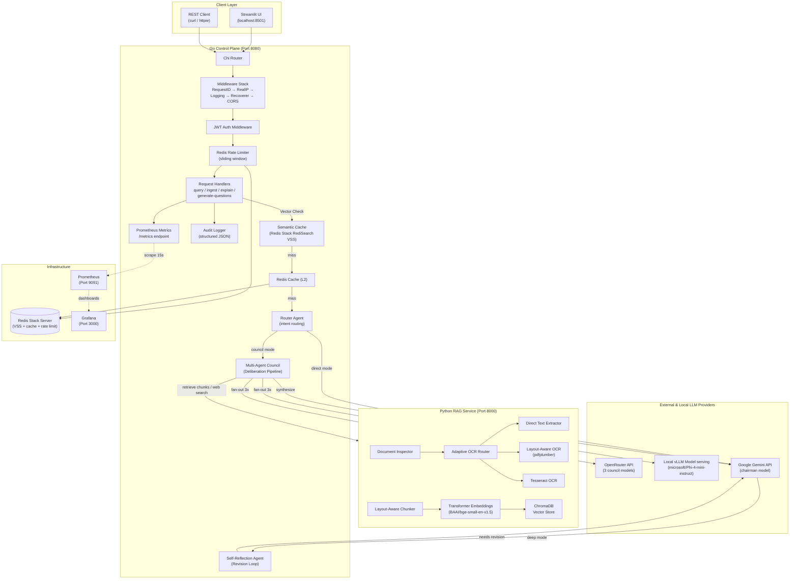
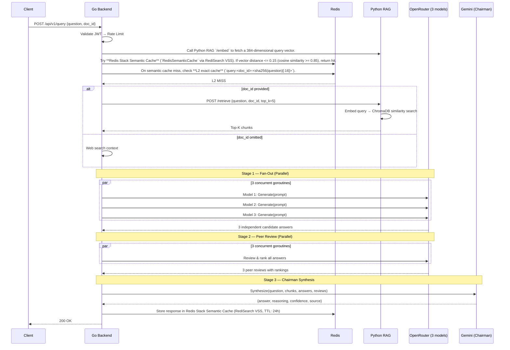

# CouncilAI: System Design Document

**Last Updated:** May 2026

---

## 1. Context & Scope

**CouncilAI** is a multi-agent document deliberation and Q&A engine.

Instead of relying on a single Large Language Model (LLM), CouncilAI coordinates a multi-agent workflow: a **Router Agent** classifies queries (using BME sampling for document summary routing), parallel **Council Member Agents** propose responses, a **Peer-Review Loop** cross-evaluates candidates, a **Chairman Agent** synthesizes the consensus, and a **Self-Reflection Agent** audits the results. This produces answers with built-in confidence scoring and reasoning chains.

### User Journeys (In Scope)
* **Document Q&A**: Upload a PDF → ask questions → get council-synthesized answers grounded in the document.
* **General Q&A**: Ask questions without a document → get answers grounded with real-time Web Search.
* **Document Explanation**: Get adaptive explanations (beginner/intermediate/advanced depth).
* **Assessment Generation**: Generate MCQ or subjective questions from document content.

---

## 2. Goals & Non-Goals

### Goals
1. **Consensus-driven accuracy** via multi-model evaluation.
2. **Confidence scoring** — every answer carries a numeric confidence rating.
3. **High Throughput** — utilizes Redis Stack Vector Similarity Search (RediSearch) semantic caching to reduce redundant LLM API calls.
4. **Extensibility** — designed for modular integration of LLMs and OCR backends.
5. **Local Compatibility** — support for offline local vLLM models.

### Non-Goals
* **Long-Term Multi-Turn Chat Memory**: Persistent, searchable chat history across years is out of scope for the current design phase (stateless sessions are used).
* **Role-Based Access Control (RBAC)**: Fine-grained permissions (Admin vs Editor) are not needed for this personal project.
* **Multi-Modal Output Generation**: Generating charts or images in the final answer is not in scope.

---

## 3. High-Level Design

### 3.1 Architecture Overview

### 3.2 Service Boundaries

| Service | Language | Port | Responsibility |
|---------|----------|------|----------------|
| **Go Backend** | Go 1.22 | 8080 | API gateway, auth, caching, LLM orchestration, metrics |
| **Python RAG** | Python 3.11 | 8000 | Document processing, OCR, chunking, embedding, retrieval |
| **Redis** | — | 6379 | Cache (1h TTL) + per-user rate limiting |
| **Prometheus** | — | 9091 | Metrics collection |
| **Grafana** | — | 3000 | Pre-built dashboards |

---

## 4. Detailed Design

### 4.1 Data Flow: Core Query (Cache Miss)

### 4.2 Scalability & Reliability

*   **Go Backend Scaling:** The Go control plane is entirely stateless (auth is JWT-based, cache is in Redis/L1). It can be horizontally scaled behind an Nginx load balancer.
*   **Progressive Degradation:** The orchestrator handles LLM failures dynamically. If 2 out of 3 models fail, it skips peer review. If peer reviews fail, it picks the longest candidate. If Chairman fails, it falls back to the highest peer-reviewed answer.
*   **Security:** Rate limiting via Redis sliding windows protects against abuse. JWT handles stateless auth. All queries are audit logged to structured JSON.

---

## 5. Alternatives Considered

*   **Single Monolithic Python Service vs. Multi-Service:** We considered writing the entire stack in FastAPI (Python). 
    * *Decision:* Rejected. Go provides vastly superior concurrent HTTP handling and goroutine orchestration necessary for the parallel fan-out loops of the multi-agent council. We accepted the ~5ms network overhead between Go and Python to use the best tool for each job (Go for orchestration, Python for ML/RAG).
*   **LangChain Default Splitters vs. Custom Layout-Aware Chunking:** We considered `RecursiveCharacterTextSplitter`. 
    * *Decision:* Rejected. It arbitrarily splits tables and captions, destroying context. We built a custom chunker that preserves semantic structure (tables remain whole, headings attach to body).

---

## 6. Architectural Decision Registry (ADR)

#### Decision 1: Redis Stack RediSearch Vector Search vs. C++ SIMD CGo Cache [SUPERSEDED]
* **Context**: Initially, an in-process C++ AVX2 SIMD cache (`fastcache`) was used for L1 vector similarity caching.
* **Evolution & Final Decision**: Migrated to **Redis Stack Vector Similarity Search (RediSearch)** (`redis/redis-stack-server`). This unifies L1 and L2 caching into a single distributed, persistent store, eliminates CGo toolchain dependencies (`CGO_ENABLED=0`), enables stateless Go backend horizontal scaling, and preserves cache entries across service restarts with automatic 24h TTL expiration.
* **Trade-offs**: Requires Redis Stack Server container image instead of standard `redis:alpine`. Provides $O(\log N)$ vector search natively inside the Redis engine.

#### Decision 2: Zero-Fee Local Web Search (DDG + BeautifulSoup) vs. Headless Browser
* **Context**: Ground queries locally without API costs.
* **Logic**: Playwright runs complete Chromium engines (>500MB bloat). Utilizing `duckduckgo-search` + `beautifulsoup4` retrieves context in milliseconds with near-zero image footprint.
* **Trade-offs**: Susceptible to DDG layout changes or Cloudflare bot protections.

#### Gap 1: In-Memory User Ephemerality
* **Description**: User accounts are stored in-memory in `auth.go`. A server restart wipes the map, forcing users to sign up again.
* **Solution**: (Planned) Refactor to SQLite/Redis Hash persistence.

#### Gap 2: CGo Toolchain & AVX2 Lock-in [SUPERSEDED]
* **Description**: CGo bindings and AVX2 intrinsics created cross-compilation friction on ARM64 / Apple Silicon.
* **Solution**: Completely removed CGo fastcache and migrated to pure Go (`CGO_ENABLED=0`) with Redis Stack RediSearch VSS and zero-copy `unsafe.Slice` float32 vector serialization.

#### Gap 3: Path Traversal Vulnerabilities in Document Ingestion [RESOLVED]
* **Description**: Python RAG `/ingest` route handles raw filenames directly when generating `doc_id`.
* **Solution**: Added rigorous regex scrubbers inside `ingest.py` before building `doc_id`.

#### Gap 4: Missing Generated `doc_id` in Go Audit Logging [RESOLVED]
* **Description**: Go backend logged an empty string in `h.Audit.LogIngest`.
* **Solution**: Unmarshaled the `/ingest` response in `ingest.go` to capture the generated `doc_id`.

#### Gap 5: FIFO Eviction vs. True LRU Caching [RESOLVED]
* **Description**: `SemanticCache` behaved conceptually as a FIFO cache.
* **Solution**: Upgraded `Get` lock scopes to `std::unique_lock` on hits to safely promote accessed keys to the front of `lru_list_`.

### 6.1 Engineering Gaps & Solutions

**1. Go/Python Context Propagation**
* **Gap**: Currently, context cancellation in the Go backend (e.g. client disconnect) is not fully propagated to the Python RAG service during long ingestion or retrieval tasks.
* **Solution**: Implement context-aware HTTP requests in Go using `req.WithContext(ctx)` when calling the Python service. The Python service (using FastAPI/Starlette) should listen for client disconnects via `request.is_disconnected()`.
* **Pros**: Prevents dangling resource locks and wasted GPU/CPU cycles on orphaned requests.
* **Cons**: Requires rewriting Python endpoints to support async polling on `request.is_disconnected()`.

**2. Database Persistence for Users and Logs**
* **Gap**: Users are stored in an ephemeral in-memory map. Audit logs are written to flat JSON files. 
* **Solution**: Introduce SQLite or PostgreSQL for relational persistence of users, and ship logs to a robust TSDB or structured logging aggregator like Loki.
* **Pros**: Enables persistent accounts across restarts and scalable analytics.
* **Cons**: Increases deployment complexity and requires database migrations.

### 6.2 Conceptual Gaps & Solutions

**1. Document Summary-Aware Routing**
* **Gap**: The Router agent was previously blind to document content. It routed queries to the LLM Council even when the user asked entirely unrelated questions (e.g. "What is the capital of France?" while a highly technical PDF was attached), wasting expensive RAG retrieval and context window.
* **Solution**: Implemented BME (Beginning-Middle-End) document sampling in the Python RAG to generate a concise representation of the document upon ingestion. The `IngestAgent` in Go generates a high-level summary, which is injected into the Router's prompt for query classification.
* **Pros**: Massive cost savings and latency reduction by dynamically skipping RAG and falling back to 'Direct' mode for off-topic queries.
* **Cons**: The BME summary adds latency during document ingestion (one-time cost) and may miss niche topics hidden deep in large documents.

**2. Metric Evaluation of Council Consensus**
* **Gap**: The system lacks an automated, scalable way to verify the objective accuracy of the Council's synthesized output against a known ground truth.
* **Solution**: Implemented a canonical benchmark suite (`tests/bench_semantic_accuracy.py`) to systematically test accuracy and caching latency.
* **Pros**: Creates an empirical feedback loop for prompt engineering and model selection.
* **Cons**: Maintaining a high-quality, ground-truth benchmark dataset requires continuous manual curation.
